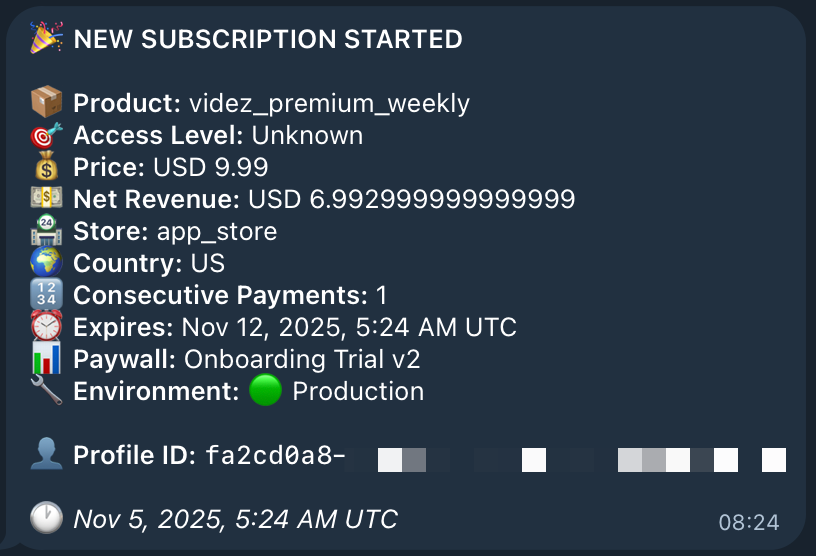
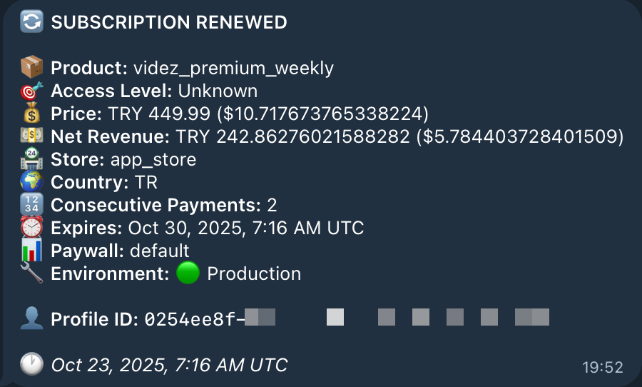
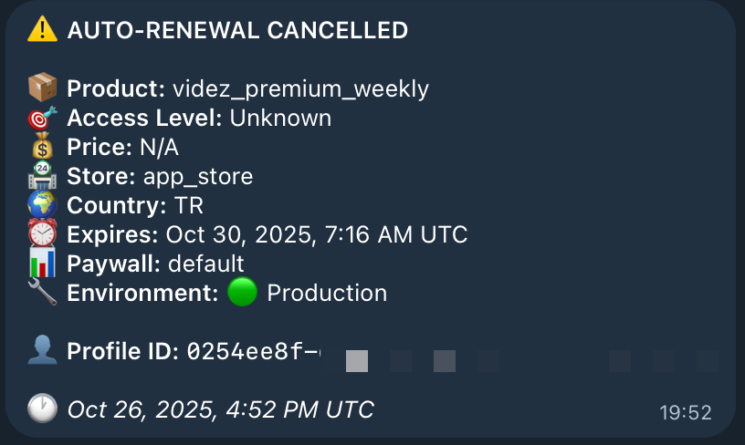

<div align="center">

# 🔔 Adapty Telegram Webhook

**A lightweight Cloudflare Worker that forwards [Adapty](https://adapty.io) subscription events to Telegram in real-time**

[](LICENSE)
[](https://workers.cloudflare.com/)
[](https://core.telegram.org/bots/api)
[](https://deploy.workers.cloudflare.com/?url=https://github.com/egebese/Adapty-Notifications-for-Telegram)

[Features](#-features) • [Quick Start](#-quick-start) • [Configuration](#-configuration) • [Documentation](#-message-format) • [Support](#-support)

</div>

---

## ✨ Features

<table>
<tr>
<td width="50%">

### 🚀 Performance
- **Real-time notifications** - Instant webhook delivery
- **Global edge network** - Low latency worldwide
- **Free hosting** - 100K requests/day on Cloudflare
- **Zero maintenance** - Serverless architecture

</td>
<td width="50%">

### 🔒 Security & Reliability
- **Bearer token auth** - Secure webhook validation
- **Production-only mode** - Auto-filters sandbox events
- **Encrypted secrets** - Cloudflare Workers KV
- **100% uptime** - Cloudflare infrastructure

</td>
</tr>
<tr>
<td width="50%">

### 📊 Rich Data
- **Detailed metrics** - Revenue, pricing, conversions
- **Multi-currency support** - Local + USD pricing
- **Paywall tracking** - A/B testing insights
- **HTML formatting** - Beautiful Telegram messages

</td>
<td width="50%">

### ⚙️ Customization
- **Event filtering** - Choose which events to track
- **Custom domains** - Use your own domain
- **Message templates** - Fully customizable format
- **Easy deployment** - One command setup

</td>
</tr>
</table>

## 📋 Supported Events

<table>
<thead>
<tr>
<th width="10%">Emoji</th>
<th width="30%">Event Type</th>
<th>Description</th>
<th width="20%">Use Case</th>
</tr>
</thead>
<tbody>
<tr>
<td align="center">🎉</td>
<td><code>subscription_started</code></td>
<td>New subscription started</td>
<td>Track new customers</td>
</tr>
<tr>
<td align="center">🔄</td>
<td><code>subscription_renewed</code></td>
<td>Subscription renewed</td>
<td>Monitor retention</td>
</tr>
<tr>
<td align="center">⚠️</td>
<td><code>subscription_renewal_cancelled</code></td>
<td>Auto-renewal cancelled</td>
<td>Identify churn risk</td>
</tr>
<tr>
<td align="center">✅</td>
<td><code>subscription_renewal_reactivated</code></td>
<td>Auto-renewal reactivated</td>
<td>Track win-backs</td>
</tr>
<tr>
<td align="center">💰</td>
<td><code>non_subscription_purchase</code></td>
<td>One-time purchase (credits, IAPs)</td>
<td>Monitor transactions</td>
</tr>
</tbody>
</table>

## 📸 Screenshots

See what you'll receive in Telegram:

<table>
<tr>
<td width="33%" align="center">

<br><strong>🎉 New Subscription</strong>
</td>
<td width="33%" align="center">

<br><strong>🔄 Subscription Renewed</strong>
</td>
<td width="33%" align="center">

<br><strong>⚠️ Auto-renewal Cancelled</strong>
</td>
</tr>
</table>

<div align="center">

**Rich, detailed notifications with pricing, revenue, location, and more!**

</div>

## 📦 Prerequisites

<table>
<tr>
<td>

**Required**
- ☁️ [Cloudflare account](https://dash.cloudflare.com/sign-up) (free tier)
- 📱 [Telegram account](https://telegram.org/)
- 🔧 [Node.js 18+](https://nodejs.org/)
- 💳 [Adapty account](https://app.adapty.io/)

</td>
<td>

**Knowledge**
- Basic command line usage
- How to create Telegram bots
- Understanding of webhooks
- Familiarity with environment variables

</td>
</tr>
</table>

## 🚀 Quick Start

### 1. Clone and Install

```bash
git clone https://github.com/egebese/Adapty-Notifications-for-Telegram.git
cd Adapty-Notifications-for-Telegram
npm install
```

### 2. Create a Telegram Bot

1. Open Telegram and search for **@BotFather**
2. Send `/newbot` command
3. Follow the instructions to create your bot
4. Save the **Bot Token** (looks like `123456789:ABCdefGHIjklMNOpqrsTUVwxyz`)

### 3. Get Your Telegram Chat ID

**Option A: Personal notifications**
1. Search for **@userinfobot** on Telegram
2. Start a chat with it
3. It will reply with your **Chat ID** (looks like `123456789`)

**Option B: Group notifications**
1. Create a group and add your bot to it
2. Send a message in the group
3. Visit `https://api.telegram.org/bot<BOT_TOKEN>/getUpdates`
4. Find the `chat.id` in the response (negative number for groups)

### 4. Generate an Auth Token

```bash
# macOS/Linux
openssl rand -base64 32

# Windows (PowerShell)
[Convert]::ToBase64String((1..32 | ForEach-Object { Get-Random -Maximum 256 }))
```

Save this token - you'll need it for both the worker and Adapty.

### 5. Configure Secrets

Set your secrets in Cloudflare Workers (they'll be prompted):

```bash
npx wrangler secret put TELEGRAM_BOT_TOKEN
# Paste your bot token from BotFather

npx wrangler secret put TELEGRAM_CHAT_ID
# Paste your chat ID

npx wrangler secret put WEBHOOK_AUTH_TOKEN
# Paste the auth token you generated
```

### 6. Deploy to Cloudflare Workers

```bash
npm run deploy
```

After deployment, you'll get a URL like:
```
https://adapty-telegram-webhook.your-subdomain.workers.dev
```

**Save this URL!** You'll need it for Adapty configuration.

### 7. Configure Adapty Webhook

Now connect your Cloudflare Worker to Adapty.

**Step-by-step:**

1. **Open Adapty Dashboard**
   - Go to [app.adapty.io](https://app.adapty.io/)
   - Navigate to **Integrations** → **Webhook**

2. **Toggle Webhook On**
   - Enable the webhook integration

3. **Configure Production Endpoint**
   - **Production endpoint URL**: `https://your-worker.workers.dev/webhook`
     - Replace with your actual worker URL from step 6
   - **Authorization header value**: `Bearer YOUR_AUTH_TOKEN`
     - Use the same token you set with `wrangler secret put`

4. **Configure Sandbox Endpoint** (Optional but recommended)
   - **Sandbox endpoint URL**: `https://your-worker.workers.dev/webhook` (same URL)
   - **Authorization header value**: `Bearer YOUR_AUTH_TOKEN` (same token)
   - Note: Sandbox events will be filtered by the worker (no Telegram notifications)

5. **Select Event Types**
   - Under **Events names** section, enable the events you want to track:
     - ✅ `subscription_started` - New subscriptions
     - ✅ `subscription_renewed` - Renewals
     - ✅ `subscription_renewal_cancelled` - Cancellations
     - ✅ `subscription_renewal_reactivated` - Reactivations
     - ✅ `non_subscription_purchase` - One-time purchases (if applicable)

6. **Additional Options** (Optional)
   - ✅ **Exclude historical events** - Recommended to avoid sending old events
   - You can leave other options unchecked unless you need them

7. **Save Configuration**
   - Click **Save** at the bottom

<details>
<summary>📝 <strong>Example Configuration</strong></summary>

```
Production endpoint URL:
https://adapty-telegram-webhook.your-subdomain.workers.dev/webhook

Authorization header value for production endpoint:
Bearer ABC123YourSecretTokenHere

Sandbox endpoint URL:
https://adapty-telegram-webhook.your-subdomain.workers.dev/webhook

Authorization header value for sandbox endpoint:
Bearer ABC123YourSecretTokenHere

Events enabled:
✓ subscription_started
✓ subscription_renewed
✓ subscription_renewal_cancelled
✓ subscription_renewal_reactivated
✓ non_subscription_purchase
```
</details>

> **⚠️ Important:** Make sure the Bearer token in Adapty exactly matches the `WEBHOOK_AUTH_TOKEN` you set in Cloudflare Workers!

### 8. Test the Integration

Set your worker URL and auth token:

```bash
export WEBHOOK_URL=https://your-worker.workers.dev/webhook
export WEBHOOK_AUTH_TOKEN=your-auth-token-here
```

Then run the test:

```bash
# Quick test (single event)
./test-webhook-simple.sh

# Full test suite (all events + security tests)
./test-webhook.sh
```

You should receive notifications in your Telegram chat! 🎉

## ⚙️ Configuration

### Custom Domain (Optional)

To use a custom domain instead of `*.workers.dev`:

1. Add your domain to Cloudflare
2. Edit `wrangler.toml`:

```toml
[[routes]]
pattern = "webhook.yourdomain.com/*"
zone_name = "yourdomain.com"
```

3. Deploy: `npm run deploy`
4. Update Adapty webhook URL to your custom domain

### Environment Filtering

**By default, sandbox events are automatically filtered** and won't send Telegram notifications. This prevents test transactions from cluttering your notifications.

To receive sandbox notifications, edit `src/index.js` around line 103:

```javascript
if (environment === 'Sandbox') {
  // Comment out this entire block to receive sandbox notifications
}
```

### Event Filtering

To track different events, edit the `TRACKED_EVENTS` array in `src/index.js`:

```javascript
const TRACKED_EVENTS = [
  'subscription_started',
  'subscription_renewed',
  'subscription_renewal_cancelled',
  'subscription_renewal_reactivated',
  'non_subscription_purchase'
];
```

See [Adapty Event Types](https://docs.adapty.io/docs/webhook-event-types-and-fields) for all available events.

### Message Customization

Edit the `formatTelegramMessage()` function in `src/index.js` to customize notification formatting.

## 🛠️ Development

<table>
<thead>
<tr>
<th width="30%">Command</th>
<th>Description</th>
</tr>
</thead>
<tbody>
<tr>
<td><code>npm run dev</code></td>
<td>🔥 Run locally with hot reload</td>
</tr>
<tr>
<td><code>npm run tail</code></td>
<td>📊 View live production logs</td>
</tr>
<tr>
<td><code>npm run deploy</code></td>
<td>🚀 Deploy to Cloudflare Workers</td>
</tr>
<tr>
<td><code>./test-webhook-simple.sh</code></td>
<td>✅ Quick single event test</td>
</tr>
<tr>
<td><code>./test-webhook.sh</code></td>
<td>🧪 Full test suite (8 tests)</td>
</tr>
</tbody>
</table>

## 💬 Message Format

Each notification includes comprehensive data from Adapty webhooks, beautifully formatted in HTML:

<div align="center">

</div>

### 📝 Fields Included

<table>
<tr>
<td width="50%">

**📊 Subscription Details**
- Product ID & base plan
- Access level granted
- Store type (App Store, Play Store, Stripe)
- User's country

</td>
<td width="50%">

**💰 Financial Data**
- Price in local currency
- USD conversion (if different)
- Net revenue (after platform cuts)
- Consecutive payment count

</td>
</tr>
<tr>
<td width="50%">

**⏰ Timing Information**
- Event timestamp
- Subscription expiry date
- Renewal information

</td>
<td width="50%">

**🎯 Analytics**
- Paywall name (A/B testing)
- Environment (Production/Sandbox)
- Profile & Customer IDs

</td>
</tr>
</table>

**Note:** Not all fields may be present in every webhook - only available data is shown.

## 🔌 API Endpoints

<table>
<thead>
<tr>
<th width="25%">Endpoint</th>
<th width="15%">Method</th>
<th width="20%">Auth Required</th>
<th>Description</th>
</tr>
</thead>
<tbody>
<tr>
<td><code>/health</code></td>
<td><code>GET</code></td>
<td>❌ No</td>
<td>Health check with configuration status</td>
</tr>
<tr>
<td><code>/webhook</code></td>
<td><code>POST</code></td>
<td>✅ Yes (Bearer)</td>
<td>Main webhook endpoint for Adapty events</td>
</tr>
<tr>
<td><code>/*</code></td>
<td><code>OPTIONS</code></td>
<td>❌ No</td>
<td>CORS preflight handling</td>
</tr>
</tbody>
</table>

## 🔍 Troubleshooting

### Not receiving notifications?

1. **Check Adapty Event Feed**: Dashboard → Event Feed to see if events are being sent
2. **View worker logs**: `npm run tail`
3. **Test health endpoint**: `curl https://your-worker.workers.dev/health`
4. **Verify secrets**: Health endpoint shows boolean flags for each secret
5. **Check bot permissions**: Make sure you've sent `/start` to your bot

### Authorization errors?

1. **Token mismatch**: Ensure Adapty's Bearer token matches your `WEBHOOK_AUTH_TOKEN`
2. **Check logs**: `npm run tail` shows received vs. expected token (first 10 chars)
3. **Verify format**: Header must be `Authorization: Bearer YOUR_TOKEN`

### Bot not sending messages?

1. **Start conversation**: Send `/start` to your bot first
2. **Verify token**: Check `TELEGRAM_BOT_TOKEN` is correct
3. **Check chat ID**: Ensure `TELEGRAM_CHAT_ID` is correct (use @userinfobot)
4. **Group permissions**: If using a group, ensure bot has send message permissions

### Testing with real Adapty events

Make a test purchase in your app to trigger real events. Remember:
- **Sandbox purchases** won't send notifications (by design)
- **Production purchases** will send notifications
- Check worker logs with `npm run tail` to see what's happening

## 💰 Cost

<table>
<thead>
<tr>
<th>Service</th>
<th>Free Tier</th>
<th>Paid Tier</th>
<th>Typical Usage</th>
</tr>
</thead>
<tbody>
<tr>
<td>Cloudflare Workers</td>
<td>100,000 requests/day</td>
<td>$5/month for 10M requests</td>
<td>~1,000-5,000/day</td>
</tr>
<tr>
<td>Telegram Bot API</td>
<td>Unlimited messages</td>
<td>Always free</td>
<td>Unlimited</td>
</tr>
<tr>
<td><strong>Total</strong></td>
<td colspan="3" align="center"><strong>$0/month for most apps 🎉</strong></td>
</tr>
</tbody>
</table>

## 🔐 Security

<table>
<tr>
<td width="50%">

**✅ Implemented**
- Bearer token authorization
- Encrypted secrets (Cloudflare KV)
- CORS headers configured
- Rate limiting (Cloudflare)
- Input validation
- Error handling (no data leaks)

</td>
<td width="50%">

**⚠️ Best Practices**
- Rotate auth tokens regularly
- Use strong random tokens (32+ bytes)
- Never commit `.env` file
- Monitor logs for suspicious activity
- Use custom domains with HTTPS
- Review Adapty webhook IPs

</td>
</tr>
</table>

## 📚 Resources

<table>
<tr>
<td width="50%">

**📖 Documentation**
- [Adapty Webhook Docs](https://docs.adapty.io/docs/webhook)
- [Adapty Event Types](https://docs.adapty.io/docs/webhook-event-types-and-fields)
- [Telegram Bot API](https://core.telegram.org/bots/api)
- [Cloudflare Workers](https://developers.cloudflare.com/workers/)
- [Wrangler CLI](https://developers.cloudflare.com/workers/wrangler/)

</td>
<td width="50%">

**🔗 Related Projects**
- [Adapty SDK](https://github.com/adaptyteam)
- [Cloudflare Workers Examples](https://github.com/cloudflare/workers-sdk)
- [Telegram Bot Examples](https://core.telegram.org/bots/samples)

</td>
</tr>
</table>

## 🤝 Contributing

Contributions are welcome! Here's how you can help:

<table>
<tr>
<td width="33%">

**🐛 Report Bugs**
Found a bug? [Open an issue](https://github.com/egebese/Adapty-Notifications-for-Telegram/issues) with:
- Steps to reproduce
- Expected behavior
- Actual behavior
- Logs from `npm run tail`

</td>
<td width="33%">

**💡 Suggest Features**
Have an idea? [Create a feature request](https://github.com/egebese/Adapty-Notifications-for-Telegram/issues) with:
- Use case description
- Proposed implementation
- Example mockups/code

</td>
<td width="33%">

**🔧 Submit PRs**
Want to contribute code?
1. Fork the repo
2. Create feature branch
3. Make your changes
4. Test thoroughly
5. Submit PR

</td>
</tr>
</table>

## 📄 License

MIT License - see [LICENSE](LICENSE) file for details

## 💬 Support

<table>
<thead>
<tr>
<th width="30%">Type</th>
<th>Channel</th>
</tr>
</thead>
<tbody>
<tr>
<td>🐛 <strong>Bug Reports</strong></td>
<td><a href="https://github.com/egebese/Adapty-Notifications-for-Telegram/issues">GitHub Issues</a></td>
</tr>
<tr>
<td>💡 <strong>Feature Requests</strong></td>
<td><a href="https://github.com/egebese/Adapty-Notifications-for-Telegram/issues">GitHub Issues</a></td>
</tr>
<tr>
<td>📖 <strong>Adapty Support</strong></td>
<td><a href="https://help.adapty.io/">Adapty Help Center</a></td>
</tr>
<tr>
<td>☁️ <strong>Cloudflare Support</strong></td>
<td><a href="https://community.cloudflare.com/">Cloudflare Community</a></td>
</tr>
</tbody>
</table>

---

<div align="center">

## ⭐ Star History

[](https://star-history.com/#egebese/Adapty-Notifications-for-Telegram&Date)

---

### 👨‍💻 Created by Ege Bese

[](https://x.com/egebese)
[](https://ege.md)
[](https://github.com/egebese)

**Made with ❤️ for mobile app developers**

If this project helped you, consider [⭐ starring it on GitHub](https://github.com/egebese/Adapty-Notifications-for-Telegram)

</div>
